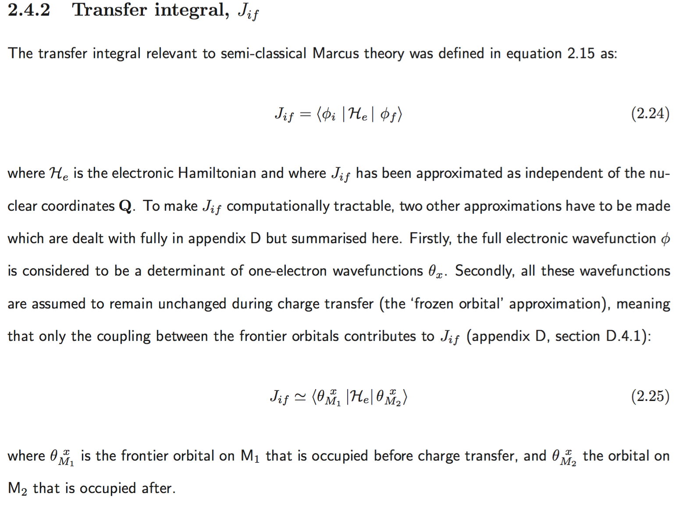

_Adapted from code by J.Kirkpatrick to deal with GAMESS-UK output by Joe Kwiatkowski on 12/09/07_

Summary
====================================================================================================
Calculate the transfer integral between two molecules based on the output of Gaussian calculations.
From [page 42 of my PhD thesis](http://docs.google.com/viewer?a=v&pid=sites&srcid=am9lamsuY29tfGpvZS1rd2lhdGtvd3NraXxneDo1YmQ5NDc0NjkyNDMyYWZh):

Instructions
====================================================================================================

Compile
--------------------------------------------------
Compile with make.  This puts 'rewrite_S_Phi_E.x' and 'get_J.m' in ~/bin

Run 
--------------------------------------------------

## Quantum calculations

Run three Gaussian jobs:

	1. single molecule 1 in the same orientation as when it is in the pair (e.g. xxx_1.com)
	2. single molecule 2 -"- (e.g. xxx_2.com)
	3. pair of molecules (e.g. xxx_pair.com)

Typical input to Gaussian jobs: 

	# b3lyp nosymm punch=mo iop(3/33=1
		nosymm necessary to prevent reorientation of molecule to standard orientation.
		punch=mo puts orbital coefficients in fort.7.  This must be
		moved to xxx_x.pun
		iop(3/33=1) forces output of the overlap matrix in the
		xxx_x.log file

## Calculate transfer integral
Run **rewrite\_S\_Phi\_E.x** with the prefix to Gaussian calculations (1), (2) and (3). 

	Note, need to do so in this order!  This program expects to find 3 log files and 3 pun files.

You should now have 7 output .txt files:

	Evls_pair.txt  MOs_1.txt  MOs_2.txt  MOs_pair.txt  S_1.txt  S_2.txt S_pair.txt

Run **octave ~/bin/get\_J.m**:

	You will be prompted for the number of MOs and the HOMO of a monomer.  
	For very small molecules (with nBasis<3) you might have to comment out some 
	calculations attempted (on non-existant orbitals) in get_J.m

Compare examples/ethylene_b3lyp with Figure 1 in [JACS 2006 128 9882-9886](http://pubs.acs.org/doi/abs/10.1021/ja061827h)
